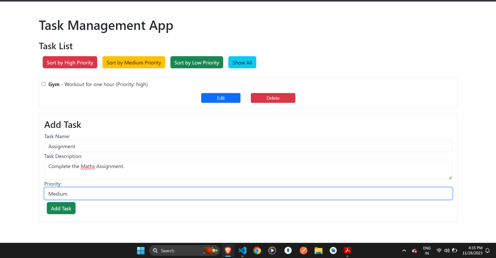
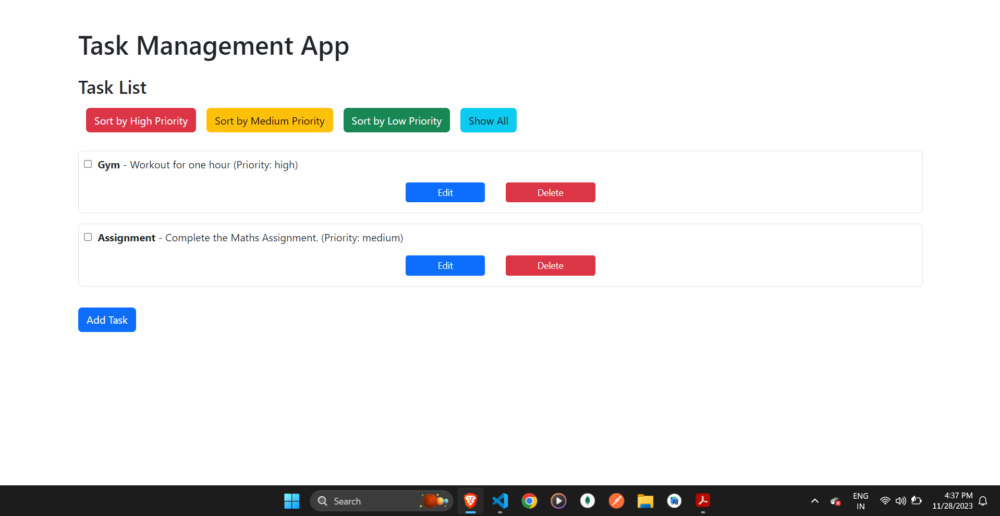
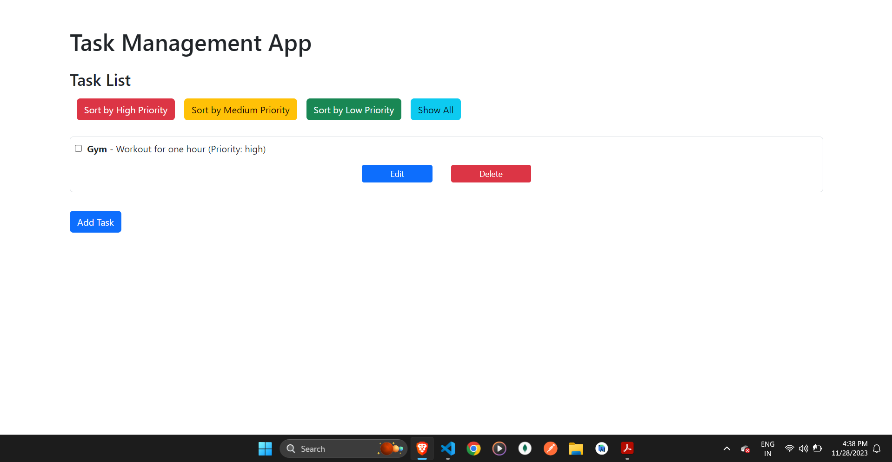

Certainly! Below is a sample README.md file based on the provided code. Make sure to customize it further based on additional details and specific features of your application.

---

# Task Management App

A simple task management application built with React.

## Table of Contents

1. [Project Structure](#project-structure)
2. [Design Choices](#design-choices)
3. [Additional Features](#additional-features)
4. [Screenshots or GIFs](#screenshots-or-gifs)
5. [Installation](#installation)
6. [Usage](#usage)
7. [Contributing](#contributing)
8. [License](#license)

## Project Structure

```plaintext
├── src/
│   ├── components/
│   │   ├── TaskList.js
│   │   ├── AddTaskForm.js
│   │   ├── EditTaskForm.js
│   │   └── ... (other components)
│   ├── App.js
│   ├── index.js
│   └── ...
├── public/
│   ├── index.html
│   └── ...
├── README.md
└── ...
```

The project is organized into components, including TaskList, AddTaskForm, and EditTaskForm, each handling specific aspects of the application.

## Design Choices

The application is designed with a simple and clean user interface, making use of Bootstrap for styling. It includes features such as adding tasks, marking them as complete, editing task details, and sorting tasks by priority.

## Additional Features

- Sorting by Priority:Users can sort tasks by high, medium, and low priority, as well as view all tasks.

## Screenshots or GIFs




## Installation

To run the project locally, follow these steps:

```bash
# Clone the repository
git clone https://github.com/jarvis4130/Task-Management

# Navigate to the project directory
cd task_management

# Install dependencies
npm install
```

## Usage

To start the application, run:

```bash
npm start
```

Visit [http://localhost:3000](http://localhost:3000) in your web browser to use the Task Management App.

## Contributing

Feel free to contribute to the project by reporting issues, submitting feature requests, or contributing code. Follow the guidelines in the [CONTRIBUTING.md](CONTRIBUTING.md) file.

## License

This project is licensed under the [MIT License](LICENSE).

---

Feel free to customize and expand on each section based on the specifics of your project. Including clear and detailed documentation in your README helps others understand and contribute to your project effectively.